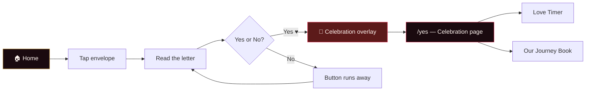
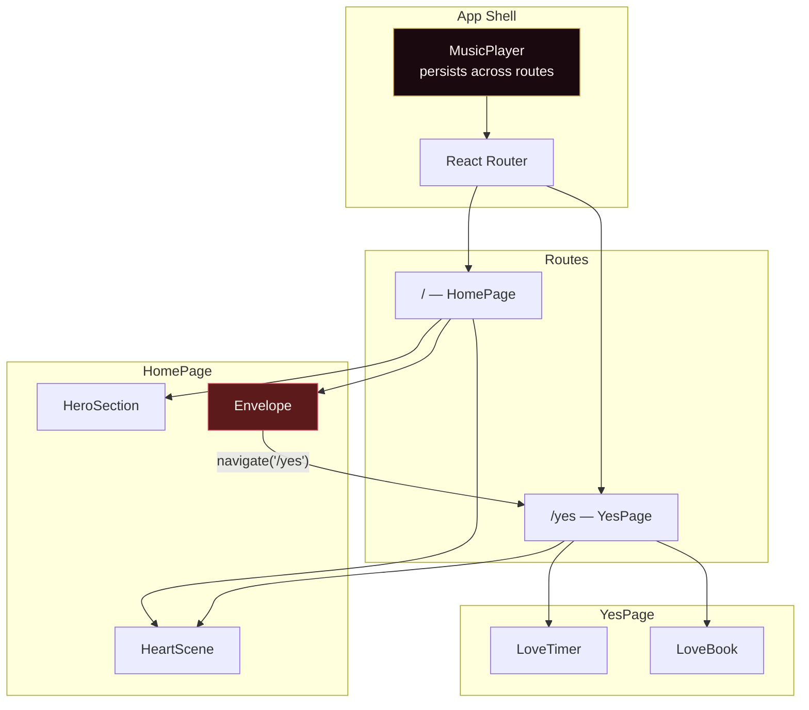

<div align="center">

# For You, Always 💖

**A personal, interactive Valentine web experience — built with love and React.**

Tap open a letter, dodge the inevitable _No_, celebrate the _Yes_, and explore a story written just for one person.

<br />


</div>

---

## Overview

**Will You Be My Girlfriend** is a single-page romantic web app that turns a simple question into a full interactive experience. It combines a 3D heart backdrop, animated typography, a playful envelope interaction, a curated music player, and a post-_Yes_ celebration page with a live relationship timer and a flip-through love book.

The app is designed to feel intimate and polished - like a digital love letter, not a generic template.

---

## Features

| Feature                     | Description                                                                                                                  |
| --------------------------- | ---------------------------------------------------------------------------------------------------------------------------- |
| **3D Heart Scene**          | Twenty-five extruded hearts rendered with Three.js, gently floating and responding to cursor movement                        |
| **Animated Hero**           | Letter-by-letter title reveal powered by Anime.js, with Playfair Display & Cormorant Garamond typography                     |
| **Interactive Envelope**    | SVG envelope with flap animation; opens to reveal a personal letter and the big question                                     |
| **The Runaway _No_ Button** | Each _No_ click teleports the button across the screen with escalating messages — until it disappears entirely               |
| **Yes Celebration**         | Confetti, balloons, and a 3-second countdown before redirecting to the celebration page                                      |
| **Music Player**            | Persistent YouTube-powered player with vinyl disc UI, playlist, shuffle, seek, and volume — optimized for mobile and desktop |
| **Love Timer**              | Live counter showing days, hours, minutes, and seconds together since your start date                                        |
| **Our Journey Book**        | Six-page interactive book with candlelight, 3D cover flip, and page-turn animations                                          |

---

## User Journey



---

## Tech Stack

| Layer           | Technology                             |
| --------------- | -------------------------------------- |
| **Framework**   | React 19 + TypeScript                  |
| **Build tool**  | Vite 8                                 |
| **Routing**     | React Router DOM 7                     |
| **3D graphics** | Three.js (WebGL heart particles)       |
| **Animation**   | Anime.js v4                            |
| **Styling**     | Tailwind CSS 4 + CSS custom properties |
| **Audio**       | YouTube IFrame Player API              |
| **Deployment**  | Vercel (SPA rewrites configured)       |

---

## Project Structure

```
will_you_be_my_girlfriend/
├── src/
│   ├── App.tsx                 # Router setup & global MusicPlayer
│   ├── main.tsx                # React entry point
│   ├── index.css               # Theme tokens, global styles, keyframes
│   ├── components/
│   │   ├── HeartScene.tsx      # Three.js floating hearts background
│   │   ├── HeroSection.tsx     # Landing hero with animated title
│   │   ├── Envelope.tsx        # Letter interaction & yes/no logic
│   │   ├── MusicPlayer.tsx     # YouTube player UI & queue management
│   │   └── LoveBook.tsx        # Six-page flip book component
│   ├── pages/
│   │   ├── YesPage.tsx         # Post-yes celebration page
│   │   └── LoveTimer.tsx       # Relationship duration counter
│   └── data/
│       └── songs.ts            # Featured & playlist song definitions
├── index.html                  # Fonts, meta, app shell
├── vercel.json                 # SPA rewrite rules for client-side routing
├── vite.config.ts
└── package.json
```

---

## Getting Started

### Prerequisites

- **Node.js** 20 or later
- **npm**, **Yarn**, or **pnpm**

### Install

```bash
git clone <your-repo-url>
cd will_you_be_my_girlfriend
npm install
```

### Development

```bash
npm run dev
```

Open the URL shown in your terminal (typically `http://localhost:5173`).

### Production build

```bash
npm run build
npm run preview   # preview the production build locally
```

### Lint

```bash
npm run lint
```

---

## Customization Guide

Most personal content lives in a handful of files. Update these to make the experience yours.

### Relationship start date

Edit the `START_DATE` constant in `src/pages/LoveTimer.tsx`:

```ts
const START_DATE = new Date("2025-05-14T00:00:00");
```

### Envelope messages

The escalating _No_ button copy is in `src/components/Envelope.tsx` — update the `MESSAGES` array:

```ts
const MESSAGES = [
  "Will you be my girlfriend? 💕",
  "Are you sure? 🥺",
  // ...
];
```

### Love book pages

Each chapter of _Our Journey_ is defined in the `PAGES` array inside `src/components/LoveBook.tsx`. Each page has a `title`, `emoji`, and `content` paragraphs.

### Music playlist

Add or remove tracks in `src/data/songs.ts`:

```ts
export const FEATURED_SONGS = [
  /* opener pool — one picked at random */
];
export const PLAYLIST_SONGS = [
  /* rest of the queue */
];
```

Each entry needs a YouTube `id`, `title`, and `artist`. The player picks a random featured song on load, then merges the remaining featured tracks into the queue after the opener finishes.

### Hero copy

Update the landing headline and subtitle in `src/components/HeroSection.tsx`, and the celebration page title in `src/pages/YesPage.tsx`.

### Color palette

Global theme tokens are defined in `src/index.css`:

```css
:root {
  --rose: #e8375a;
  --rose-light: #ff6b8a;
  --cream: #fff5f0;
  --gold: #c8973a;
  --ink: #1a0a0f;
}
```

---

## Architecture Notes



**Music player behavior:** The YouTube player is mounted once at the app root so playback continues when navigating from `/` to `/yes`. A tap-to-play overlay satisfies browser autoplay policies before music starts.

**Envelope z-index layering:** The blur overlay, letter popup, flying _No_ button, and music player are carefully stacked so interactions remain predictable on every attempt.

---

## Deployment

The project includes a `vercel.json` with SPA rewrites so client-side routes like `/yes` resolve correctly in production.

### Deploy to Vercel

1. Push the repository to GitHub.
2. Import the project in [Vercel](https://vercel.com).
3. Use the default build settings:
   - **Build command:** `npm run build`
   - **Output directory:** `dist`
4. Deploy.

Other static hosts (Netlify, GitHub Pages with a rewrite rule, Cloudflare Pages) work as long as all routes fall back to `index.html`.

---

## Browser Support

Works best in modern browsers with WebGL support (Chrome, Firefox, Safari, Edge). Mobile layouts include a bottom-bar music player with safe-area padding for notched devices.

> **Note:** Music playback requires a user gesture (tap) due to browser autoplay restrictions. The app handles this with a full-screen _Tap to play music_ overlay on first load.

---

## License

This is a personal project. Feel free to fork and adapt it for your own story — just swap in your memories, songs, and dates.

---

<div align="center">

Made with 💖 · _For my favourite person_

</div>
